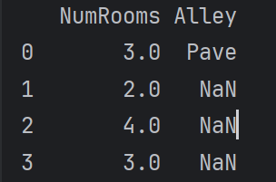
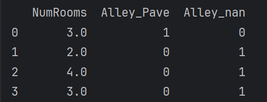
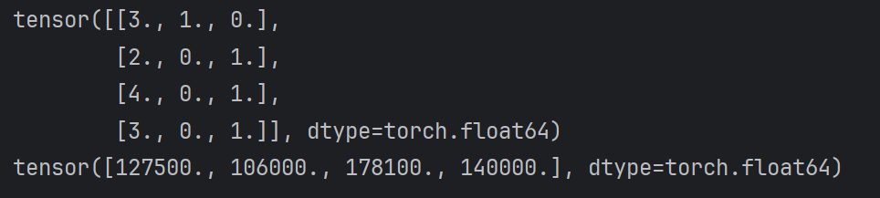

---

layout: post

title: 02-预备知识

date: 2025-01-22 01:27:23 +0900

categories: [DeepLearning]

---

- [2. 预备知识](#2-预备知识)
  - [2.1  数据操作🎊](#21--数据操作)
    - [广播机制](#广播机制)
    - [索引和切片](#索引和切片)
    - [节省内存:执行原地操作](#节省内存-执行原地操作)
    - [与其他python对象的转换](#与其他python对象的转换)
  - [2.2  数据预处理](#22--数据预处理)
  

### 2. 预备知识

#### 2.1  数据操作🎊

- `x = torch.arange(num)  # 非额外指定，张量存储在内存，基于CPU计算` 
- `x.shape`
- `x.numel()  # 张量中元素的总数`
- `x.reshape(num1,num2,...)`
- `torch.zeros((num1,num2,num3,...))`
- `torch.ones((num1,num2,num3,...))`
- `torch.randn(num1,num2)  # 从均值为0，标准差为1的正态分布(高斯分布)中随机采样` 

------

- `x ** y  # x的y次幂`

- `torch.exp(x)`

- ```python
  X = torch.arange(12, dtype=torch.float32).reshape((3, 4))        # shape:[3,4]
  Y = torch.tensor([[2, 1, 4, 3], [1, 2, 3, 4], [4, 3, 2, 1]])     # shape:[3,4]
  print(torch.cat((X, Y), dim=0))                                  # shape:[6,4]
  print(torch.cat((X, Y), dim=1))                                  # shape:[3,8]
  ```

- `X == Y`

- `X.sum()  # 对张量中所有元素进行求和`    

------

##### 广播机制

```python
[[0],                    [[0,0],    [[1,2],

 [1],  +  [[1,2]]  ---->  [1,1],  +  [1,2], 

 [2]]                     [2,2]]     [1,2]]
```

------

##### 索引和切片

`X[-1],X[1:3]`

可以写入

------

##### 节省内存：执行原地操作

```python
Z = torch.zeros_like(Y)
Z[:] = X + Y
```

```python
X += Y  # 后续计算没有重复使用X的情况下
```

------

##### 与其他python对象的转换

```python
A = X.numpy()
B = torch.tensor(A)

print(type(A))
print(type(B))  # 共享底层内存，就地操作更改一个也会更改另一个

# <class 'numpy.ndarray'>
# <class 'torch.Tensor'>
```

------

<br><br/>

<br><br/>

#### 2.2  数据预处理

1. 数据集文件的创建与读取

   ```python
   import os
   
   os.makedirs(os.path.join('..', 'data'), exist_ok=True)  # 在当前文件的上一级创建文件夹data
   data_file = os.path.join('..', 'data', 'house_tiny.csv')  # 在文件夹data里面创建csv文件
   with open(data_file, 'w') as f:
       f.write('NumRooms,Alley,Price\n')  # 列名
       f.write('NA,Pave,127500\n')  # 每行表示一个数据样本
       f.write('2,NA,106000\n')
       f.write('4,NA,178100\n')
       f.write('NA,NA,140000\n')
   ```

   ```python
   import pandas as pd            
                                   
   data = pd.read_csv(data_file)	
   print(data)					 
   ```

   > ​        NumRooms    Alley   Price
   >
   > 0                   NaN    Pave   127500
   >
   > 1                     2.0     NaN   106000
   >
   > 2                     4.0     NaN   178100
   >
   > 3      	     NaN     NaN    140000

2. 处理缺失值

   ```python
   # inputs: data的前两列
   # output: data的第三列
   inputs, outputs = data.iloc[:, 0:2], data.iloc[:, 2]
   inputs = inputs.fillna(inputs.mean())  # 用同一列的均值填充缺少的数值
   print(inputs)  # 用均值填充后的inputs如下
   ```

   <center></center>

   ```python
   # 将非数值数据转为数值数据
   inputs = pd.get_dummies(inputs, dummy_na=True)
   print(inputs)  # 处理后的inputs如下
   ```

   <center></center>

3. 转换为张量格式

   ```python
   # 将数值数据转为张量
   x = torch.tensor(inputs.to_numpy(dtype=float))
   y = torch.tensor(outputs.to_numpy(dtype=float))
   print(x)
   print(y)
   ```

   <center></center>

------

<br>

<br/>

<br>

<br/>

#### 2.3  线性代数

##### 基本数学对象

1. 标量：只有**一个元素**的张量，由小写字母表示
2. 向量：通过**一维张量**表示，通常记为粗体、小写的符号
3. 矩阵：在代码中表示为**具有两个轴的张量**，通常用粗体、大写字母来表示（行列数相同为方阵）
4. 张量：描述具**有任意数量轴**的n维数组的通用方法，用特殊字体的大写字母表示（例如X, Y, Z）

------

##### 张量算法的基本操作

```python
A = torch.arange(20, dtype=torch.float32).reshape(5, 4)
B = A.clone()  # 通过分配新内存，将A的一个副本分配给B, B不随A变化
```

**平均值**

```python
print(A.mean())
print(A.sum() / A.numel())

print(A.mean(axis=0))
print(A.sum(axis=0)/A.shape[0])
```

> tensor(9.5000)
> tensor(9.5000)
> tensor([ 8.,  9., 10., 11.])
> tensor([ 8.,  9., 10., 11.])

**求和**

- 降维求和

  ```python
  A_sum_axis0 = A.sum(axis=0)  # 沿axis=0方向压缩
  print(A_sum_axis0)
  print(A_sum_axis0.shape)  
  ```

  > tensor([40., 45., 50., 55.])
  > torch.Size([4])

- 非降维求和

  ```python
  sum_A = A.sum(axis=0, keepdims=True)
  print(sum_A)  # shape->[1,4]
  ```

  > tensor([[40., 45., 50., 55.]])     

  ```python
  res = A.cumsum(axis=0)
  print(res)
  ```

  > tensor([[ 0.,  1.,  2.,  3.],
  >               [ 4.,  6.,  8., 10.],
  >               [12., 15., 18., 21.],
  >               [24., 28., 32., 36.],
  >               [40., 45., 50., 55.]])	

**乘法**

- 两个矩阵的按元素乘法(Hadamard积)

  res.ij = A.ij * B.ij

  ```python
  A * B
  ```

- 两个向量的点积

   x^T^Y

  ```python
  torch.dot(x,y)
  ```

  ```python
  torch.sum(x * y)
  ```

- 矩阵-向量积

  A.shape = [a,b]

  x.shape = [b]

  res.shape = [a]

  ```python
  torch.mv(A,x)
  ```

- 矩阵矩阵乘法(矩阵乘法)

  ```python
  torch.mm(A,B)
  ```

------

##### 范数

**L~2~范数**：常省略下标2

<center></center>

```python
u = torch.tensor([3.0,-4.0])
torch.norm(u)  # 5
```

**L~1~范数**：受异常值的影响较小

<center></center>

```python
torch.abs(u).sum()  # 7
```

**矩阵的Frobenius范数**

<center></center>

```python
torch.norm(torch.ones((4,9)))  # 6
```

