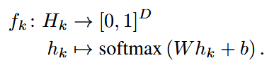

来源：Understanding intermediate layers using linear classifier probes

> 线性probe表现差，只能说明：该标签信息不能被当前探针从该表示中稳定的线性读取。
>
> 信息仍可能以非线性形式存在，或分布在多个层等。

probe 只读取中间表示，**梯度不传回原网络**。

- 沿传播方向，每层的信息减少；

  > 直觉上，如果下一层Z只能通过前一层Y得知再前一层X，那么进一步处理Y不会让Z获得更多X的信息

- 越深层的表示，线性分类器更容易预测类别。(probe结论)

  > 深层网络主要在重组信息而非创造信息

- (W, b)：probe可训练参数；L：线性分类器(probe)损失；
- 如果一个简单的线性函数就能稳定分类，说明这些类别向量信息已经比较线性可分，即成功与失败样本在第l层形成了某种可被线性决策边界区分的结构。
- 为什么probe要优化？假如某层probe表现很差，存在以下两种情况：

  - 该层的确不容易被线性分类；

  - 本来可以线性分类，只是probe没有训练好(通过训练优化排除)