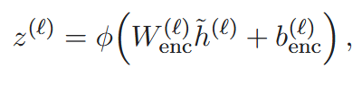
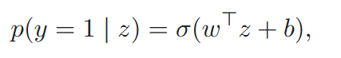

来源：Beyond the Black Box: Interpretability of Agentic AI Tool Use

> Agent 在**执行动作前**，是否“知道”自己需要调用工具，以及即将采取的工具动作有多大风险

对于tool-use failures，现有方法难以在错误可见前诊断。(3种失败：(1)本来需要工具，Agent却直接回答； (2)本来不需要，却进行了调用； (3) 采取了具有较大外部后果的行动。) 早期的一次错误调用使整个执行轨迹逐渐偏离，同时增加token消耗以及安全风险。

- E，Expected：根据任务要求，当前是否应该使用工具；
- I，Internal：probe 从模型内部读到的工具倾向；
- A，Actual：Agent 最终是否真的调用了工具。

| 情形               |    E |    I |    A | 解释                           |
| ------------------ | ---: | ---: | ---: | ------------------------------ |
| 正确不调用         |    0 |    0 |    0 | 无需外部工具                   |
| 正确调用           |    1 |    1 |    1 | 正常委托                       |
| 漏调且内部已知道   |    1 |    1 |    0 | 模型内部信号正确，但行为未落实 |
| 漏调且内部也没识别 |    1 |    0 |    0 | 表征或识别层面的失败           |
| 不必要调用         |    0 | 0或1 |    1 | Agent 过度委托                 |

(1) 内部状态提取与probe训练

```text
决策上下文 x_i
      ↓ 模型前向传播
各层最后32个 token 的隐藏状态
      ↓ mean pooling
各层向量 h̃ᶫ
      ↓ 对应层输入预训练 SAE
稀疏特征 zᶫ
      ↓ 跨层拼接
最终特征 z
```

> SAE(Sparse Autoencoder, 稀疏自编码器)：把一个高维、稠密的hidden state，映射成一个更高维但非常稀疏的feature表示。

> 为什么使用SAE？直接用各层平均池化后的向量再拼接不可以吗？
> 文章中提供了raw的tool-needed和tool-risk的结果，raw方案预测的比SAE更准。**因此如果目标只是想要根据模型内部状态预测是否需要调用工具的话，直接raw residual probe更简单。**
>
> 当前文章还关注：信息在哪里，由哪些内部feature表示，因而采用SAE，SAE提供了一个较好的候选概念坐标系。

- SAE：



- probe训练(两个独立)：

  tool-need：



> 跨数据集时分类阈值需要重新校准

tool-risk: 三分类softmax，low(只读搜索、查询和信息获取)、Medium(有限范围的写入或创建操作)、High(身份认证、账户操作等)

> 同linear-probe：如果简单的线性函数就能区分工具需求或风险，说明这些信息已经以相对容易读取的方式存在与SAE表示中。如果使用更复杂的分类器，可能只是分类器自己学习了复杂转换。
>
> 跨层拼接后的SAE特征空间很高维，而且许多特征可能相关，使用正则化处理。

(2) 特征排名与消融

训练tool-need probe时，每个SAE特征z<sub>j</sub>对当前预测的直接贡献是：c<sub>j</sub> = w<sub>j</sub> z<sub>j</sub>

- 选取排名较高的一小组SAE特征；
- 不重新训练probe，用原参数重新计算；
- 比较与原来的结果，结果是否翻转与数值变化。

****