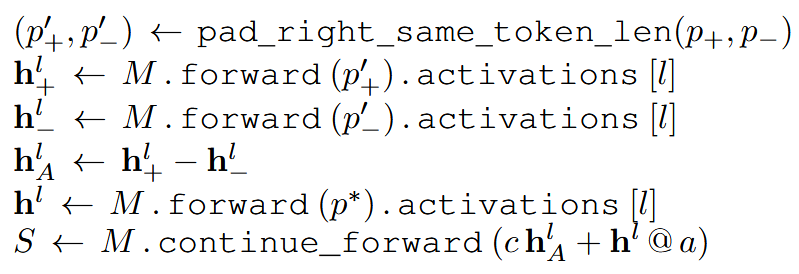

来源：STEERING LANGUAGE MODELS WITH ACTIVATION ENGINEERING

> activation engineering：在推理时直接修改模型的中间激活，从而控制输出行为

$$
v_{\text{positive}}\approx h(\text{Love})-h(\text{Hate})
$$

| 符号 | 含义                                     |
| ---- | ---------------------------------------- |
| p_+  | 代表目标属性的正向提示                   |
| p_-  | 与目标属性相反或中性的提示               |
| p^*  | 用户真正希望模型续写的提示               |
| l    | 提取并注入激活的 Transformer 层          |
| c    | 注入强度                                 |
| a    | 引导向量与用户提示在序列位置上的对齐方式 |



```text
p+ ──前向传播──> h+ ─┐
                      ├─ 相减 ─> 引导向量(steering vector) hA
p− ──前向传播──> h− ─┘
                              │ × c
                              ▼
p* ──运行到第 l 层──> h* ──相加──> h̃* ──继续运行──> 输出
```

> 通常l从中间注入最有效

****

 


